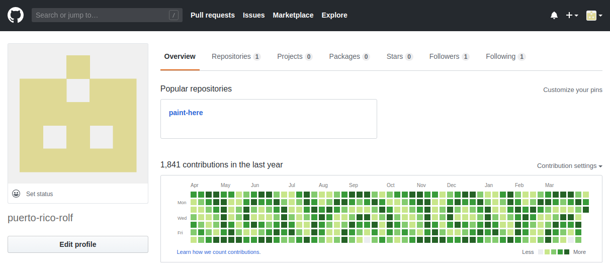

# GitHub Profile Painter

A little Python script that sends daily git commits from AWS Lambda to a specified GitHub repository. Exactly the right amount of commits to produce a pattern on GitHub's contribution overview.

